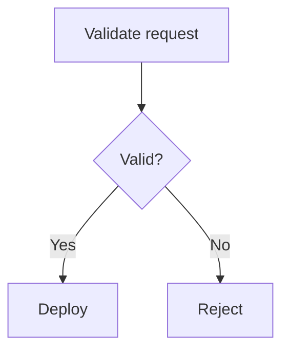

# Writing Project Documentation

These rules apply to READMEs, advanced guides, contributor guides, architecture
notes, tutorials, task guides, reference documentation, troubleshooting pages,
release notes, API documentation, command documentation, configuration
documentation, screenshots, diagrams, and documentation examples.

Documentation is part of the product. A project is not fully usable when its
behavior exists only in source code, issue discussions, chat messages, or the
memory of a maintainer.

Use this guide with [`GENERAL.md`](GENERAL.md) for present-state writing and code
comment requirements, [`NAMING.md`](NAMING.md) for names used in examples, and
[`PLANNING.md`](PLANNING.md) when a documentation plan is requested.

## Contents

- [Authority and scope](#authority-and-scope)
- [Core documentation standard](#core-documentation-standard)
- [Documentation as the single source of truth](#documentation-as-the-single-source-of-truth)
- [Write for a defined reader](#write-for-a-defined-reader)
- [Organize the documentation set](#organize-the-documentation-set)
- [Split a README and an advanced guide deliberately](#split-a-readme-and-an-advanced-guide-deliberately)
- [Use cognitive funneling](#use-cognitive-funneling)
- [Choose the correct topic type](#choose-the-correct-topic-type)
- [Plan documentation before writing](#plan-documentation-before-writing)
- [Voice and tone](#voice-and-tone)
- [Write clear and translatable language](#write-clear-and-translatable-language)
- [Use inclusive and respectful language](#use-inclusive-and-respectful-language)
- [Respect source licensing and legal content](#respect-source-licensing-and-legal-content)
- [Ground every claim in evidence](#ground-every-claim-in-evidence)
- [Protect secrets and personal information](#protect-secrets-and-personal-information)
- [Use portable Markdown](#use-portable-markdown)
- [Structure pages predictably](#structure-pages-predictably)
- [Format text by meaning](#format-text-by-meaning)
- [Write useful code examples](#write-useful-code-examples)
- [Write procedures that people can complete](#write-procedures-that-people-can-complete)
- [Use lists for scannable information](#use-lists-for-scannable-information)
- [Use tables only for real comparisons](#use-tables-only-for-real-comparisons)
- [Create durable and descriptive links](#create-durable-and-descriptive-links)
- [Use alerts sparingly](#use-alerts-sparingly)
- [Document user interfaces precisely](#document-user-interfaces-precisely)
- [Document keyboard input consistently](#document-keyboard-input-consistently)
- [Use illustrations only when they add meaning](#use-illustrations-only-when-they-add-meaning)
- [Make all documentation accessible](#make-all-documentation-accessible)
- [Document specialized technical surfaces](#document-specialized-technical-surfaces)
- [Document releases and lifecycle changes](#document-releases-and-lifecycle-changes)
- [Maintain documentation continuously](#maintain-documentation-continuously)
- [Review documentation systematically](#review-documentation-systematically)
- [Reusable templates](#reusable-templates)
- [Documentation anti-patterns](#documentation-anti-patterns)
- [Definition of done](#definition-of-done)

## Authority and scope

Apply this file to documentation written for developers, operators, users,
reviewers, maintainers, security teams, and contributors.

The rules cover:

- Repository and subproject `README.md` files.
- Optional `ADVANCED.md` guides.
- Documentation under a dedicated documentation directory.
- `CONTRIBUTING.md`, `SECURITY.md`, and similar project guides.
- Architecture and decision documentation.
- Command-line interface, API, configuration, and library reference material.
- Tutorials, how-to guides, migration guides, and troubleshooting topics.
- Release notes, known issues, deprecations, and retirement notices.
- Markdown examples embedded in issues, pull requests, and templates when those
  examples are intended to become durable project guidance.
- Images, diagrams, video links, and other media used by documentation.

Project-specific documentation rules may add requirements for a static site
generator, front matter, shortcodes, link syntax, or generated references.
Those local requirements override portable formatting defaults only where the
renderer requires it.

The following requirements never become optional:

- Accuracy.
- Security.
- Accessibility.
- Clear ownership.
- Present-state descriptions.
- Honest limitations.
- Runnable or explicitly illustrative examples.

Do not copy a provider-specific shortcode, Liquid tag, HTML component, or
front-matter field into a different project unless that project supports it.

## Core documentation standard

Good project documentation lets a reader answer these questions without
inspecting implementation source:

1. What is this project or component?
1. What problem does it solve?
1. Is it suitable for my need?
1. What do I need before I use it?
1. How do I install or access it?
1. What does normal use look like?
1. What are its important limits and risks?
1. Where do I find exact reference information?
1. How do I diagnose common failures?
1. How is the project licensed and maintained?

Documentation must be:

- Correct: It matches shipped behavior, accepted inputs, outputs, defaults,
  permissions, and supported environments.
- Useful: It helps a defined reader make a decision or complete a goal.
- Discoverable: Readers can find it from the README, navigation, search terms,
  or nearby related content.
- Scannable: Headings, short paragraphs, lists, and examples expose the page
  structure.
- Complete at its chosen level: A task includes every required step. A reference
  includes the full contract it claims to cover.
- Concise: Every sentence contributes new information.
- Honest: Limitations, destructive effects, prerequisites, and uncertainty are
  visible before they affect the reader.
- Maintainable: The content has a clear owner and does not duplicate volatile
  facts without a reason.
- Accessible: Text carries the essential meaning, and formatting does not
  exclude readers who use assistive technology.
- Secure: Examples never expose credentials, personal data, or unsafe defaults.
- Portable: Standard Markdown carries the core content unless the publishing
  system requires an extension.

Length is not a quality signal. A short page can be complete, and a long page
can still omit the one fact a reader needs. Make a document as short as possible
without removing information required for correct and safe use.

Documentation defines the supported public contract. If users must inspect the
implementation to learn routine usage, the abstraction is incomplete.

## Documentation as the single source of truth

Durable product information belongs in the documentation set. Do not leave the
only explanation in:

- A pull request description.
- An issue comment.
- A chat thread.
- A commit message.
- A code review discussion.
- A private document.
- A maintainer's memory.

When a recurring question has no documented answer:

1. Identify the canonical page that owns the answer.
1. Add the missing information to that page.
1. Link to the page when answering the question elsewhere.

Prefer linking to canonical documentation over repeatedly paraphrasing it in
support conversations. Repeated paraphrases drift and create competing
contracts.

Single source of truth does not mean that every sentence may appear only once.
Small, intentional duplication can help readers complete a task without jumping
between pages. Duplicate information only when all of these conditions hold:

- The repeated fact is necessary in both contexts.
- One location remains the canonical owner.
- The duplicate is short.
- The maintenance cost is understood.
- A change to the fact has an obvious way to find every copy.

Do not duplicate large procedures, configuration tables, or API contracts.
Link to the owner instead.

Keep source and documentation changes together when behavior changes. A feature
is not complete when its public behavior changes but its documentation still
describes the previous behavior.

## Write for a defined reader

Before writing, identify:

- The intended reader.
- The reader's goal.
- The knowledge the reader is expected to have.
- The environment the reader is using.
- The role or permissions the reader needs.
- The consequences if the reader follows the instructions incorrectly.
- The next question the reader is likely to ask.

Write for the least specialized reader who can reasonably complete the task.
Do not assume every reader knows internal project vocabulary, deployment
architecture, framework conventions, or organizational history.

Use progressive disclosure:

- Give all readers the broad purpose and normal path first.
- Give active users setup and routine tasks next.
- Give specialists internals, tuning, rare operations, and edge cases later.

Focus on reader outcomes, not implementation effort.

Use:

```text
Use branch protection to require approval before changes reach the default
branch.
```

Avoid:

```text
The team implemented a branch protection feature that allows users to require
approval.
```

Address the reader as "you" in task-oriented documentation. Use a named role
when permissions or responsibility matter.

Use:

```text
Project maintainers can rotate the signing key.
```

Avoid:

```text
You can rotate the signing key.
```

The second example is inaccurate if most readers lack the required role.

## Organize the documentation set

Give each kind of information a clear owner.

| Document                   | Primary purpose                                                                                             |
| -------------------------- | ----------------------------------------------------------------------------------------------------------- |
| Root README                | Explain the whole repository, provide the shortest successful path, and route readers to owned subprojects. |
| Subproject README          | Explain one independently usable component, its normal setup, common commands, and routine operation.       |
| Advanced guide             | Hold substantial specialist material that would obstruct the normal README path.                            |
| Contributor guide          | Explain contribution setup, review expectations, development workflow, and contribution policy.             |
| Architecture guide         | Explain system boundaries, ownership, data flow, important constraints, and architectural reasoning.        |
| API reference              | Define endpoints, authentication, requests, responses, errors, limits, and examples.                        |
| CLI reference              | Define commands, arguments, options, output, exit status, and examples.                                     |
| Configuration reference    | Define keys, types, defaults, allowed values, scope, precedence, and restart requirements.                  |
| Troubleshooting guide      | Map observable symptoms to diagnosis, cause, resolution, and recovery.                                      |
| Security policy            | Define supported versions, private reporting channels, response expectations, and disclosure policy.        |
| Changelog or release notes | Record user-visible changes by release.                                                                     |
| License                    | State the legal terms for use and distribution.                                                             |

Do not use `ADVANCED.md` as a substitute for:

- A complete API reference.
- A contributor guide.
- A security policy.
- A changelog.
- A collection of architectural decisions.
- Generated reference documentation.

Create subproject documentation at real ownership boundaries. Do not add a
README to every directory. A directory README is justified when the directory
represents an independently operated component, has a distinct workflow, or
needs orientation that cannot remain clear in the parent guide.

Avoid navigation chains that force a reader through several index pages before
reaching useful content. A link should move the reader closer to the goal.

Use standard repository filenames with their established capitalization:

- `README.md`
- `ADVANCED.md`
- `CONTRIBUTING.md`
- `SECURITY.md`
- `CHANGELOG.md`
- `LICENSE`

Do not create variants such as `ReadMe.md` or `advanced-guide.md` when the
standard name already describes the document's role.

Keep discovery metadata consistent with the documentation:

- Repository description.
- Package or module description.
- Package-manager keywords.
- Repository topics.
- Published documentation title and summary.

Use the README one-liner as the source for these short descriptions when the
platform limits permit it. Do not add unrelated popular keywords to attract
traffic.

## Split a README and an advanced guide deliberately

The default structure for a substantial project or subproject is:

- `README.md` for evaluation, first success, routine use, essential caveats, and
  navigation.
- `ADVANCED.md` only when specialist material is large enough to disrupt that
  path.

The split is a tool, not a quota. Small components need only a focused README.

### What belongs in the README

The README is the primary entry point. A reader should not need the advanced
guide to decide whether the project fits, install it, complete the first useful
action, or understand normal operation.

Include, when relevant:

- Project or component name.
- One-sentence purpose.
- Essential context and unfamiliar terminology.
- Current status when it materially affects adoption.
- Important compatibility, security, or data-loss caveats.
- A small, runnable usage example.
- Prerequisites.
- Installation or setup.
- Normal configuration.
- The commands used most often.
- A concise architecture or data-flow overview.
- Routine testing and development commands when the README serves contributors.
- Common failures and their direct fixes.
- Links to deeper references.
- License and contribution information.

Keep exhaustive internals out of the opening path.

### Never add project layout sections

Project layout sections are prohibited in every README, advanced guide,
contributor guide, architecture guide, and other project documentation file.
Do not add or preserve a section whose purpose is to inventory the repository's
directories or files.

This prohibition includes:

- Project layout or repository layout sections.
- Directory structure or source tree sections.
- File maps and codebase maps.
- Tables that pair directories with purposes, ownership, or descriptions.
- Lists or diagrams that walk readers through the repository hierarchy.
- Renamed equivalents that provide the same directory inventory.

Do not add a project layout section even when the repository is large, the
directory boundaries seem durable, or an older document already contains one.
Remove an existing layout section instead of revising or preserving it.

Document behavior, workflows, commands, architecture concepts, and ownership
boundaries without cataloging the source tree. Mention a path inline only when
the reader must open, edit, or run that specific path to complete the documented
task.

### What belongs in an advanced guide

Create `ADVANCED.md` for coherent, substantial material such as:

- Detailed architecture and ownership boundaries.
- Internal orchestration and lifecycle behavior.
- Performance, scaling, caching, or concurrency details.
- Rare configuration combinations.
- Environment and runtime tuning.
- Complex deployment and recovery workflows.
- Deep troubleshooting and diagnostic trees.
- Provider-specific integration details.
- Full test-suite strategy when the routine commands already live in the
  README.
- Operational behavior needed by maintainers but not by most users.

An advanced guide may assume the reader understands the README. It must not
assume undocumented prerequisites.

### When to create the split

Create an advanced guide when at least one of these conditions is true:

- Three or more substantial specialist sections interrupt the normal README
  path.
- One specialist workflow is long enough that readers must scroll past it to
  reach routine setup or usage.
- The component has distinct beginner and operator or maintainer audiences.
- Detailed internals are valuable but unnecessary for safe normal use.
- The README cannot remain a quick evaluation and onboarding document without
  hiding important specialist depth.

Keep everything in the README when:

- The total content remains easy to scan.
- Advanced material is only one short section.
- Splitting would create two thin pages.
- Readers would need to switch pages during the basic setup path.
- The same information would have to be repeated in both files.

If a README becomes long, fix its structure before splitting it. Remove
repetition, move true reference material to its owner, shorten oversized
examples, and group related sections. Split only when the remaining advanced
content has a coherent audience and purpose.

### Content placement matrix

| Information                   |      README       |    Advanced guide     | Different owner                              |
| ----------------------------- | :---------------: | :-------------------: | -------------------------------------------- |
| One-line purpose              |        Yes        |          No           | None                                         |
| Minimal runnable example      |        Yes        |          No           | Example file may also own runnable code      |
| Basic prerequisites and setup |        Yes        |          No           | None                                         |
| Routine commands              |        Yes        |   Optional summary    | CLI reference for exhaustive options         |
| Essential limitations         |        Yes        | More detail if useful | None                                         |
| Architecture overview         |        Yes        |    Detailed model     | Architecture guide for large systems         |
| Rare tuning options           |  Short link only  |          Yes          | Configuration reference if exhaustive        |
| Destructive recovery          | Warning and route |    Full procedure     | Operations runbook when access is restricted |
| Public API overview           |        Yes        |  Optional internals   | API reference owns the contract              |
| Contribution workflow         |    Short route    |          No           | Contributor guide                            |
| Version history               |        No         |          No           | Changelog or release notes                   |
| Security reporting            |    Short route    |          No           | Security policy                              |

### Link the two guides

Add one clearly named advanced-guide link in the README near the point where
normal use ends and specialist material begins. Describe what the reader will
find there.

Use:

```markdown
## Advanced guide

See [the advanced guide](ADVANCED.md) for runtime tuning, deployment recovery,
and detailed architecture.
```

Avoid a bare link named "More" or "Click here."

At the top of the advanced guide, state its audience and relationship to the
README. Do not repeat the README introduction, setup procedure, or routine
command list.

### Keep the advanced guide coherent

An advanced guide is not a junk drawer. Every section must support the same
specialist audience.

Move content elsewhere when it has a different owner:

- Put contribution policy in a contributor guide.
- Put exact endpoint schemas in API reference documentation.
- Put historical changes in release notes.
- Put isolated design decisions in decision records.
- Put incident-only commands in a restricted runbook when publishing them would
  be unsafe.

Delete the advanced guide and merge its unique material back into the README if
the guide becomes small or no longer serves a distinct audience.

### Do not copy code settings into README or Advanced

The README and advanced guide explain purpose, behavior, safety, common tasks,
and recovery. Do not manually copy values that already live in application code
or configuration, including:

- Provider or model allowlists.
- Current default models or providers.
- Timeouts, token budgets, result counts, and concurrency limits.
- Accepted ranges and tuning values.
- Exhaustive option tables.
- Lists of generated filenames.

Put exact values in command help or a reference generated from the same code.
Link readers to that source when they need the current value.

Keep an exact value in the README or advanced guide only when readers need it to
avoid data loss, understand a legal or compatibility requirement, or complete a
task. The value must have one source and must not be copied from an internal
setting.

## Use cognitive funneling

Order information from broad and widely relevant to narrow and specialized.
This structure helps readers decide quickly whether to continue.

The first screen of a README should usually answer:

- What is this?
- Who is it for?
- What problem does it solve?
- What does a normal use look like?
- Is there a limitation that immediately disqualifies it?

A practical README order is:

1. Name.
1. One-sentence purpose.
1. Essential status or caveat.
1. Minimal example or result.
1. Key capabilities.
1. Prerequisites.
1. Setup.
1. Normal usage.
1. Configuration.
1. Architecture overview.
1. Common problems.
1. Deeper documentation.
1. Contribution and license.

Change the order when reader risk demands it. Put an incompatible license,
unsupported status, destructive default, security limitation, or platform
restriction near the top if it can immediately rule out use.

Do not optimize the README to maximize adoption. Optimize it to help the right
reader decide quickly and the wrong reader leave confidently.

Readers should gain progressively deeper knowledge as they continue. Do not
open with implementation internals, a complete option table, or a long project
history before explaining the purpose.

## Choose the correct topic type

Different reader goals need different structures. Identify the topic type
before writing.

### Concept

A concept topic explains what something is, why it exists, how major parts
relate, and which constraints shape it.

Use concept topics for:

- Architecture.
- Ownership.
- Data flow.
- Security models.
- Lifecycle models.
- Important domain terminology.

Do not hide required procedural steps inside a concept narrative.

### Task

A task topic helps a reader complete one concrete goal.

A task includes:

- Outcome-focused title.
- Required permissions and prerequisites.
- Ordered actions.
- Expected result.
- Verification or recovery information when the task carries risk.
- Relevant next step.

Use one task for one primary outcome. Split unrelated outcomes.

### Reference

A reference topic provides exact facts for lookup.

Use reference topics for:

- API endpoints.
- CLI commands.
- Configuration keys.
- Events.
- Error codes.
- File formats.
- Supported values.

Reference content favors completeness, consistent field order, tables for real
matrices, and small examples. It should not require narrative reading to find a
single value.

### Tutorial

A tutorial teaches through a guided, end-to-end result.

A tutorial includes:

- A visible final outcome.
- A controlled starting state.
- Complete steps.
- Enough explanation to teach the important model.
- A cleanup path for created resources.

Keep unusual variants out of the main tutorial. Route them to reference or
advanced documentation.

### Troubleshooting topic

A troubleshooting topic starts from an observable symptom.

Use this order:

1. Symptom.
1. Conditions in which it appears.
1. Diagnostic check.
1. Likely cause.
1. Resolution.
1. Recovery or rollback.
1. Escalation information if the problem remains.

Do not title troubleshooting sections only with internal causes. Readers search
for the message or behavior they can observe.

### Landing page

A landing page routes distinct audiences or goals. Keep it short.

Use:

- A one-paragraph orientation.
- A small number of descriptive links.
- Categories based on reader goals.

Do not turn a landing page into a duplicate guide.

### Release note

A release note tells an affected reader what changed, what the effect is, and
whether action is required.

Release notes are not implementation summaries. See
[Document releases and lifecycle changes](#document-releases-and-lifecycle-changes).

### Combining topic types

A README can contain several topic types because it is an entry document.
Keep each section internally consistent. A setup section should read as a task,
an options section as reference, and an architecture section as a concept.

Do not alternate between narrative, steps, and reference fields without clear
headings.

## Plan documentation before writing

For non-trivial documentation work:

1. Inspect the implementation, configuration, user interface, and existing
   documentation that define the behavior.
1. Identify the reader and primary goal.
1. Find the current owner for the topic.
1. Decide whether to update an existing page or create a new page.
1. Select the topic type.
1. List the claims that require evidence.
1. Identify security, permission, compatibility, and data-loss caveats.
1. Choose the smallest example that proves normal use.
1. Outline sections in cognitive-funnel order.
1. Identify links, images, and examples that need maintenance ownership.

Do not create a new page for one paragraph that belongs naturally on an
existing page.

Do not begin by copying source comments, tickets, or implementation notes.
Translate verified behavior into a reader-focused explanation.

A documentation plan must follow [`PLANNING.md`](PLANNING.md). Include the exact
text diff when the user asks for a plan rather than implementation.

## Voice and tone

Use a voice that is:

- Concise.
- Direct.
- Precise.
- Calm.
- Friendly.
- Confident without making unsupported claims.
- Conversational without becoming chatty.

### Prefer active voice

Use active voice when the actor matters.

Use:

```text
The worker retries the request three times.
```

Avoid:

```text
The request is retried three times by the worker.
```

Passive voice is useful when the result matters more than the actor or the
actor is genuinely unknown.

Use:

```text
The report is encrypted before storage.
```

### Speak directly to the reader

Use imperative verbs for instructions.

Use:

```text
Select **Save**.
```

Avoid:

```text
The user should select the **Save** button.
```

Use "you" when it makes a condition or result clearer.

### Describe the present state

Documentation describes current behavior. Do not narrate refactors, renamed
variables, removed systems, or previous implementations.

Use release notes, migration guides, or decision records for history when
history has a durable reader need.

Use:

```text
The client sends audio directly to the realtime provider.
```

Avoid:

```text
The client now sends audio directly instead of routing it through the API.
```

### Avoid self-referential openings

Start with the subject, not the page.

Use:

```text
Deployment uses immutable container images.
```

Avoid:

```text
This page explains how deployment works.
```

Use a brief scope sentence only when a reader needs it to distinguish this page
from a nearby topic.

### Avoid marketing language

Documentation is not sales copy.

Do not use:

- Easy.
- Easily.
- Simple.
- Simply.
- Obviously.
- Trivial.
- Best-in-class.
- Powerful.
- Revolutionary.
- Seamless.

These words do not explain the work, and they can make a struggling reader feel
at fault.

State measurable effects instead.

Use:

```text
Caching can reduce repeated database reads for identical requests.
```

Avoid:

```text
This powerful cache easily makes the application much faster.
```

### Use contractions selectively

Contractions can make tutorials and introductory material feel natural.
Avoid contractions:

- In formal reference definitions.
- In error messages.
- In strong safety requirements.
- When a negative must be unmistakable.
- With a proper noun when the result can be read as possessive.

Use "Do not delete the primary key" for a safety rule, not "Don't delete the
primary key."

### Use precise modal verbs

Use direct imperatives for required actions.

Use:

```text
Set `DATABASE_URL` before starting the service.
```

Use "can" for capability or a clearly optional choice.

Use:

```text
You can store the cache on a separate volume.
```

Avoid "may," "might," "could," "would," and "should" when the reader cannot tell
whether an action is required, recommended, or optional.

Label recommendations and optional steps explicitly.

### Use US English by default

Use US English spelling, grammar, and punctuation unless the project has chosen
another documented language standard.

Do not mix dialects within one documentation set.

## Write clear and translatable language

Write for readers and translation systems that do not share the author's local
context.

### Keep sentence structure direct

- Put the subject near the verb.
- Keep one primary idea in each sentence.
- Prefer short sentences over clauses joined by punctuation.
- Name the actor when the action could belong to more than one component.
- Repeat a noun when a pronoun would be ambiguous.
- Put conditions before actions when the condition changes whether the action
  applies.

Use:

```text
If the token has expired, request a new token.
```

Avoid:

```text
Request a new one when it has expired.
```

### Do not write sausage sentences

A sausage sentence chains many independent claims, capabilities, modes, or
operational concerns into one comma-separated sentence. The sentence can be
grammatically correct and still be unreadable. Treat this structure as a
documentation defect, not as concise writing.

Avoid:

```text
The server provides streaming generation, persona prompts, imported history,
cancellation, rate limits, health checks, telemetry, Docker images, and host
deployment automation.
```

This sentence fails because it:

- Compresses nine distinct capabilities into one claim.
- Mixes request behavior, runtime controls, observability, packaging, and
  deployment.
- Gives every item the same apparent importance.
- Hides the relationships and boundaries among the capabilities.
- Forces the reader to retain the entire inventory before understanding its
  structure.
- Sounds like a feature dump instead of explaining how the system helps the
  reader.

Use separate sentences, paragraphs, or lists to expose the structure:

```markdown
The server supports these generation workflows:

- Stream generated text.
- Apply a persona prompt.
- Import conversation history.
- Cancel an active response.

Runtime operations have separate controls:

- Rate limits control request volume.
- Health checks report service availability.
- Telemetry reports runtime behavior.

Deployment tooling includes Docker images and host automation.
```

Apply these rules:

- Keep one primary claim in each prose sentence.
- Keep an inline list only when its items are short, tightly related, and part
  of the same reader concern.
- Convert an inline list into bullets when readers need to scan, compare, or
  remember the items independently.
- Split content into separate paragraphs when it crosses conceptual levels,
  such as request behavior, runtime operations, and deployment.
- Explain a capability near its important condition, limitation, or effect.
  Do not bury those details behind a broad inventory sentence.
- Treat four or more independent capabilities in one sentence as a strong
  signal that the sentence needs restructuring.
- Do not disguise the same problem with semicolons, parentheses, repeated
  conjunctions, or phrases such as "as well as."
- Do not replace one sausage sentence with several disconnected one-sentence
  paragraphs. Group related claims under a clear lead-in or heading.

Sentence length alone does not determine whether a sentence is a sausage
sentence. A longer sentence can remain clear when every clause supports one
claim. A shorter sentence can still fail when it compresses unrelated concepts
into a feature inventory.

### Avoid hidden subjects

Avoid opening with "there is" or "there are" when a concrete subject exists.

Use:

```text
Two deployment modes support private networking.
```

Avoid:

```text
There are two deployment modes that support private networking.
```

### Avoid noun stacks

Break strings of nouns with a preposition.

Use:

```text
Settings for custom project integrations
```

Avoid:

```text
Project integration custom settings
```

### Prefer verbs over nominalizations

Use:

```text
After the workflow finishes, download the report.
```

Avoid:

```text
After completion of workflow execution, perform a download of the report.
```

### Avoid culture-specific language

Do not use:

- Idioms.
- Sports metaphors.
- Pop-culture references.
- Regional slang.
- Jokes that carry operational meaning.
- Violent metaphors when a literal alternative exists.

Use literal descriptions such as "stop the process," "remove the task," or
"replace both values."

### Avoid ambiguous connectors

Use "because" for cause.
Use "after" or "from" for time.
Use "while" only for simultaneous actions.

Do not rely on "since" when it could mean time or cause.

### Spell out abbreviations

Spell out an acronym or uncommon abbreviation on first use on each page, then
put the abbreviation in parentheses.

```text
Content delivery network (CDN)
```

Do not spell out universally familiar technical names when the expansion would
reduce clarity. Examples include API, URL, HTTP, JSON, and HTML.

Avoid acronyms in titles unless the intended audience uses the acronym as the
primary name.

Do not add apostrophes to form acronym plurals.

Use:

```text
APIs
```

Avoid:

```text
API's
```

### Write numbers consistently

In prose, spell out zero through nine and use numerals for 10 and greater.
Use numerals for:

- Measurements.
- Versions.
- Dates.
- Times.
- Percentages.
- Commands and code.
- Exact limits.
- Steps and table values.

Do not begin a sentence with a numeral. Rewrite the sentence or spell out the
number.

### Write dates and times unambiguously

For prose intended primarily for people, use:

```text
January 3, 2026 at 10:30 AM UTC
```

Include the time zone whenever readers in different regions could act on the
time.

For machine-readable values, logs, APIs, release stamps, and sortable metadata,
use ISO 8601:

```text
2026-01-03T10:30:00Z
```

Do not use ambiguous numeric dates such as `03/04/2026`.

### Write currency unambiguously

Name the currency when an amount could refer to more than one currency.

On first use in a page, write the amount and currency name:

```text
10 US dollars
```

When a page contains several amounts, add the ISO currency code on first use:

```text
10 US dollars (USD)
```

Use the symbol and code for later compact references:

```text
$0.25 USD
```

Do not write ambiguous forms such as `$10` when readers in several countries
could interpret the symbol differently.

### Use title case for document titles

Use title case for the document title at the top of every Markdown file. This rule applies to an H1
title and to a front-matter title that the publishing system renders as the H1.

Capitalize the first and last word and every major word, including nouns, pronouns, verbs,
adjectives, and adverbs. Keep minor words lowercase unless they are the first or last word. Minor
words include:

- Articles: `a`, `an`, and `the`.
- Coordinating conjunctions: `and`, `but`, `for`, `nor`, `or`, `so`, and `yet`.
- Short prepositions: `as`, `at`, `by`, `for`, `from`, `in`, `of`, `on`, `per`, `to`, `via`, and `with`.

Preserve the official capitalization of product names, acronyms, commands, and code identifiers.
For example, keep `iOS`, `API`, `GitHub`, and `npm` in their official forms.

Use:

```markdown
# Writing Project Documentation

# Working on the API

# Yap iOS Advanced Guide
```

Do not use sentence case for the document title:

```markdown
# Writing project documentation

# Yap iOS advanced guide
```

Use sentence case for H2 and lower headings, table headers, alert content, and labels written by the
documentation author.

Match the exact capitalization of:

- Product names.
- Organization names.
- Commands.
- APIs.
- User interface labels.
- Standards.
- Third-party tools.

Do not capitalize a feature as a proper name unless the project defines it as
one.

### Keep names and terminology consistent

Use the full official product, organization, framework, and standard name on
first use. Follow the capitalization used by the authoritative owner.

- Use the same term for the same concept across the documentation set.
- Do not introduce a synonym only to avoid repetition.
- Do not shorten product names unless the short form is established and
  unambiguous.
- Treat product names as singular unless the product owner defines another
  grammatical form.
- Keep feature names lowercase unless they are proper names.
- Maintain a project word list when capitalization or preferred terms are not
  obvious.

Avoid possessive forms for product and organization names when a noun phrase is
clearer.

Use:

```text
The Docker command-line interface
```

Avoid:

```text
Docker's command-line interface
```

Ending a sentence with a preposition is acceptable when the alternative would
sound unnatural or overly formal. Clarity matters more than a mechanical
grammar preference.

### Use restrained punctuation

- End complete sentences with a period.
- Use the serial comma in a list of three or more items.
- Use one space between sentences.
- Use straight quotation marks in source.
- Use a colon to introduce a list, code example, or explanation.
- Split a sentence instead of using a semicolon.
- Use commas, parentheses, colons, or separate sentences instead of em dashes
  or en dashes.

Do not use punctuation as decoration in headings.

## Use inclusive and respectful language

Use language that welcomes people across cultures, identities, abilities, and
experience levels.

- Refer to people by relevant roles, not stereotypes.
- Use gender-neutral examples unless gender is necessary to the scenario.
- Use "they" for a person whose pronouns are unknown.
- Avoid assumptions about physical ability, family structure, location, or
  access to expensive hardware.
- Do not describe an accessibility feature as a special case.
- Avoid terms with exclusionary or harmful histories when a precise neutral
  term exists.
- Use "allowlist" and "denylist" for newly named project concepts.
- Use "default branch" or the branch's actual name instead of assuming a branch
  is named `master`.
- Preserve exact external API, protocol, command, and user interface terms when
  changing them would make the documentation inaccurate.

Use "person" or a specific role when describing people. Use "user" when it is a
defined product or system role.

Examples should use varied, fictional names. Use `example.com` addresses:

```text
Alex Garcia
Sidney Jones
Zhang Wei
alex.garcia@example.com
```

Do not use real customer names, contributor email addresses, account
identifiers, or production data in examples.

## Respect source licensing and legal content

Write original documentation. Do not copy and paste from external guides,
articles, standards, or provider documentation unless a short quotation is
necessary and the source is cited.

Prefer:

- Verifying the relevant fact.
- Explaining the fact in the project's own words.
- Linking to the authoritative source for full detail.

When reusing or adapting licensed content:

- Confirm that the source license permits the intended use.
- Follow attribution, notice, and share-alike requirements.
- Identify the source and license where the reused content appears.
- Preserve required copyright notices.
- Use the exact license text supplied by the source when full license text is
  required.
- Keep an attribution close enough that readers can identify the adapted
  material.

These requirements apply to:

- Prose.
- Code examples.
- Diagrams.
- Screenshots.
- Icons.
- Templates.
- Translations.
- Generated reference material.

Do not assume that publicly visible content is free to copy.

Keep quotations brief. Use a blockquote only when the exact wording matters,
and cite the source directly after the quotation. Do not assemble a page from
large quotations.

Legal, privacy, terms, licensing, and policy documents require their approved
human-readable source. Do not compose them from dynamic fragments, reusable
sentence parts, or AI-generated text unless the project's legal workflow
explicitly approves that mechanism.

Do not alter license language to match the general documentation voice.

## Ground every claim in evidence

Do not speculate about behavior.

Verify claims against the sources that own them:

- Source code for runtime behavior.
- Public types and schemas for contracts.
- Configuration for supported values and defaults.
- Migration state for database behavior.
- User interface code or a current product build for labels and navigation.
- Tests for demonstrated scenarios, without treating test fixtures as the
  public contract by themselves.
- Provider documentation for external requirements.
- Release configuration for version and platform support.

Do not invent:

- Command syntax.
- Flags.
- Environment variables.
- API fields.
- Error codes.
- User interface labels.
- Permissions.
- Supported versions.
- Defaults.
- Performance claims.
- Security guarantees.

If evidence is incomplete, narrow the claim or state the known limitation.
Do not fill gaps with plausible behavior.

### Distinguish guarantees from observations

Use language that matches the contract.

```text
The request times out after 30 seconds.
```

This sentence is appropriate only when 30 seconds is a defined contract.

```text
In the current load test, the request completed within 30 seconds.
```

This sentence describes an observation, not a guarantee.

Do not convert a benchmark, one test run, or implementation detail into a
general promise.

### Scope version-specific statements

State the applicable version, platform, plan, role, or deployment mode when the
behavior is not universal.

Use "version 3.2 or later," not "version 3.2 or above."

Do not put temporary version details into a timeless conceptual explanation
without marking their scope.

### Review AI-assisted content

Treat AI-generated documentation as an untrusted draft.

Review for:

- Repetition.
- Fabricated commands or fields.
- Vague claims.
- Incorrect scope.
- Stale names.
- Unnecessary new pages.
- Missing permissions.
- Hidden safety consequences.
- Examples that look valid but cannot run.
- Confident statements unsupported by the codebase.

Every retained claim needs the same evidence as human-written content.

### Do not promise future behavior

Do not state that an unshipped feature will arrive in a specific release unless
an authorized product commitment exists and the documentation system has a
defined disclaimer process.

Use:

```text
Issue 123 proposes support for hardware-backed keys.
```

Avoid:

```text
Hardware-backed key support is coming in the next release.
```

Describe current behavior first. Put proposals in issue trackers, roadmaps, or
approved future-content sections.

## Protect secrets and personal information

Documentation is public by default. Treat every committed example, screenshot,
output block, and URL as publishable.

Never include:

- Real access tokens.
- API keys.
- Passwords.
- Session cookies.
- Private keys.
- Webhook secrets.
- Production connection strings.
- Private IP addresses when they reveal infrastructure.
- Customer data.
- Personal email addresses.
- Internal-only URLs.
- Unredacted request or response headers.
- Live credentials hidden in image metadata.

Use unmistakable placeholders:

```text
<ACCESS_TOKEN>
<PROJECT_ID>
<DATABASE_URL>
<YOUR_DOMAIN>
```

Use angle brackets so a reader can see the replacement boundary. Use uppercase
words joined by underscores. Explain each placeholder before or immediately
after the example.

Do not use a realistic token-shaped value that a scanner or reader could mistake
for a credential.

Use reserved example domains:

```text
https://example.com
https://api.example.com
https://service.example.net
```

Use documentation-only IP address ranges when an address is required. Do not
copy an address from a real environment.

Before adding a screenshot:

1. Replace names, email addresses, IDs, and tokens with example data.
1. Remove irrelevant browser tabs, notifications, and account details.
1. Inspect the image for metadata that should not be published.
1. Confirm that blurring cannot be reversed. Prefer replacing the source text.

Examples that mutate or delete data must use an obviously isolated resource and
must place the risk before the command.

## Use portable Markdown

Use CommonMark and GitHub Flavored Markdown as the portable baseline unless the
project renderer defines a different supported subset.

Prefer Markdown over HTML because Markdown is:

- Easier to review.
- Easier to search.
- More portable across repository hosts.
- More likely to remain accessible.
- Less likely to break with site-wide styling changes.

Use HTML only when:

- Standard Markdown cannot express the required semantic element.
- The project renderer supports the element.
- The element remains responsive and accessible.
- The source stays readable.
- The use has a clear maintenance owner.

Do not add custom CSS or layout HTML to routine Markdown pages.

### Source file format

- Store Markdown as UTF-8 without a byte-order mark.
- Use LF line endings.
- Use spaces, not tabs, for indentation.
- Leave one blank line between paragraphs and block elements.
- Remove trailing whitespace unless the renderer deliberately uses it for a
  line break.
- End the file with one newline.

### Source line length

Wrap prose at approximately 100 characters.

Do not split:

- Markdown links across source lines.
- Inline code spans.
- Product names.
- Commands.
- Values that readers need to copy as one unit.
- Logical phrases when the split makes the source harder to read.

Long URLs, tables, and code can exceed the prose target.

Do not insert manual line breaks merely to create visual spacing in rendered
text. Use separate paragraphs.

### Markdown comments

Use HTML comments for author-only maintenance notes:

```html
<!-- This table is generated from the public schema. Update the schema source. -->
```

Comments must explain maintenance requirements, generation ownership, or a
non-obvious source constraint.

Do not:

- Hide obsolete documentation in comments.
- Store drafts in published pages.
- Add change history.
- Leave reviewer conversations in source.
- Comment out broken links instead of fixing or removing them.

Delete obsolete content. Git already preserves history.

### Platform extensions

Shortcodes, Liquid tags, custom alerts, tab components, cards, and generated
macros are acceptable only when the documentation platform owns and tests them.

For each extension:

- Confirm it renders in every supported documentation surface.
- Provide a useful fallback when a secondary renderer does not support it.
- Keep essential meaning in text.
- Avoid nesting components unless the platform documents that combination.
- Do not use a component only for visual decoration.

### Interactive documentation components

Use tabs only for parallel alternatives such as operating systems, package
managers, deployment methods, or version ranges.

For tabs:

- Give every tab a short, parallel title.
- Use the same tab order across pages.
- Make each tab's procedure complete.
- Do not put headings, other tabs, or essential cross-tab instructions inside
  a tab unless the renderer explicitly supports them.
- Do not link directly to one tab unless the platform guarantees a durable
  target.
- Confirm that unsupported renderers show a usable linear fallback.

Use collapsible panels only for optional secondary detail. Do not hide:

- Required prerequisites.
- Safety warnings.
- Procedure steps.
- Error recovery.
- Accessibility information.

Use cards only on landing pages where the primary job is routing readers to a
small set of destinations. Every card needs descriptive link text and a useful
fallback list.

Use glossary tooltips only for the first important occurrence of a specialized
term. Keep the definition to one short sentence. Use a glossary page for longer
definitions.

Do not overload a page with interactive components. Every interaction adds
navigation work and a new rendering failure mode.

## Structure pages predictably

Readers learn a documentation set faster when similar pages use similar
structures.

### Titles and H1 headings

Every standalone page needs one clear title.

For repository Markdown:

```markdown
# Configure Private Networking
```

Use exactly one H1.

If the publishing system generates the H1 from front matter, put the title in
front matter and do not add a second H1 in the Markdown body.

Titles must:

- Describe the page outcome or subject.
- Use title case.
- Include the distinguishing term readers search for.
- Avoid unexplained acronyms.
- Avoid decorative punctuation.
- Avoid links.
- Remain stable enough to support durable anchors.

For tasks, prefer an imperative verb:

```text
Configure Private Networking
```

For concepts, prefer a noun phrase:

```text
Private Networking Architecture
```

For troubleshooting, prefer the observable symptom:

```text
Requests fail with `connection refused`
```

### Front matter

Use front matter only when the documentation platform defines it.

Rules:

- Include only supported fields.
- Use valid YAML or the platform's required format.
- Keep the title consistent with navigation and on-page content.
- Do not add an H1 when the platform renders the front-matter title as H1.
- Use stable identifiers for generated navigation.
- Quote values when punctuation or type inference could change their meaning.
- Do not store secrets or internal publishing credentials in metadata.
- Remove obsolete fields instead of leaving empty values.

Example:

```yaml
---
title: Configure Private Networking
description: Route service traffic through private network endpoints.
---
```

### Navigation labels and short titles

When the publishing system uses separate navigation labels:

- Keep the label shorter than the page title.
- Use the base form of an action verb.
- Reuse words from the full title.
- Omit repeated product context only when the navigation hierarchy supplies it.
- Keep sibling labels parallel.
- Do not introduce a new term that the page title never uses.

Use:

```text
Configure notifications
```

Avoid:

```text
Configuring notification preferences
```

### Introductions

The introduction should orient the reader in one or two short paragraphs.

State:

- What the subject is.
- Why the reader would use it.
- Any immediate scope or limitation.

Do not restate the title in a full sentence.

Avoid:

```text
This guide explains how to configure private networking.
```

Use:

```text
Private networking keeps service traffic off the public internet. Configure it
before deploying workloads that require internal-only access.
```

### Heading hierarchy

- Start body sections at H2.
- Increment one heading level at a time.
- Do not skip from H2 to H4.
- Avoid levels deeper than H4. Split the page when the hierarchy requires
  deeper nesting.
- Put introductory text between a heading and its first subheading.
- Make headings at the same level unique.
- Keep headings short and descriptive.
- Use sentence case.
- Do not bold heading text.
- Do not put links in headings.
- Do not number headings unless the number is a stable part of the subject.

Use:

```markdown
## Configure authentication

Choose the authentication method that matches the deployment environment.

### Use workload identity
```

Avoid:

```markdown
## Configure authentication

#### Workload identity
```

### Contents sections

Long pages need a `## Contents` section with links to the sections readers use
most.

Add a contents section when:

- The page has several H2 sections.
- Readers are likely to visit only one section.
- The rendered page requires substantial scrolling.
- The page acts as a reference.

Do not add a contents section to a short page.

Use an unordered list in document order. Include important H3 sections only
when they help readers choose a path.

```markdown
## Contents

- [Prerequisites](#prerequisites)
- [Configure the service](#configure-the-service)
- [Troubleshoot startup](#troubleshoot-startup)
```

Keep every anchor accurate when headings change.

Do not place a sectional contents list directly below a heading without a
sentence explaining how to choose among the sections.

### Section order

Use a predictable order for task-oriented pages:

1. Context.
1. Permissions or availability.
1. Prerequisites.
1. Procedure.
1. Expected result.
1. Troubleshooting.
1. Next steps or related topics.

Use a predictable order for reference pages:

1. Scope.
1. Contract summary.
1. Syntax or schema.
1. Fields or options.
1. Examples.
1. Errors and limits.
1. Related topics.

### Paragraphs

Keep paragraphs focused. Two to four sentences is a useful default, not a hard
limit.

Start a new paragraph when:

- The subject changes.
- The reader must switch from concept to action.
- A condition changes the applicable audience.
- A safety consequence needs visibility.

Do not use a one-sentence paragraph for every sentence. Excessive fragmentation
makes related ideas harder to follow.

## Format text by meaning

Formatting communicates semantics. Do not use formatting only to make a page
look more interesting.

### Bold

Use bold for:

- Interactive user interface labels.
- A short term that must be visually located in a mixed UI instruction.
- Rare, brief emphasis when the sentence cannot be made clear through wording
  alone.

Do not use bold:

- As a substitute for headings.
- For every keyword.
- For whole sentences.
- As the only way to signal danger or required behavior.
- Inside code formatting.

Keep punctuation outside bold formatting unless the punctuation is part of the
exact user interface label.

```markdown
Select **Settings** > **Access control**.
```

### Italics

Avoid italics for emphasis. Italics are harder to scan in many sans-serif
interfaces and can reduce readability.

Use italics only for established editorial purposes, such as the title of a
published work, when the project style permits it.

### Inline code

Use inline code for:

- Commands and subcommands.
- Options and flags.
- File and directory names.
- Environment variables.
- Configuration keys and literal values.
- Function, method, type, and property names.
- HTTP methods and status codes.
- Short inputs and outputs.
- Branch and repository names.
- Exact error messages from terminals, logs, or APIs.
- HTML elements, including angle brackets.

```markdown
Set `LOG_LEVEL` to `debug`, then run `service start`.
```

Do not use inline code for product names or general technical concepts.

### Quotation marks

Use straight quotation marks.

Prefer code formatting for exact text that a reader enters or sees in a
terminal.

Use quotation marks for non-interactive user interface text when the wording
must be reproduced exactly:

```text
The page displays "Deployment completed."
```

Do not put quotation marks around links, headings, or code-formatted text.

### Definition terms

Use a description list only when the renderer supports it consistently.
Otherwise, use a short list or a two-column table.

Do not simulate definitions with a long series of bold labels.

### Blockquotes

Use blockquotes only for quoted source material.

Do not use blockquotes as generic callout boxes. Use a supported alert or a
normal paragraph instead.

Keep quotations short, cite the source, and prefer paraphrasing when the exact
wording is not important.

### Emoji and icons

Do not use emoji for decoration, status, warnings, or navigation.

Use a project-owned icon only when the icon appears in the interface and helps
the reader identify an otherwise unlabeled control.

When an icon has hover or accessible text:

```text
Select **Edit** (ICON).
```

Name the action first. Do not require the reader to interpret the icon's shape.

When an interface control has no accessible name, describe it literally and
report the interface accessibility problem through the project's normal issue
process.

## Write useful code examples

Examples are part of the contract. Treat them like production-facing code.

### Make examples runnable

A runnable example must:

- Use valid syntax.
- Include required imports or surrounding structure.
- Define every non-obvious value.
- Use supported APIs.
- Avoid hidden setup.
- Use safe example data.
- Produce the described result.
- Avoid ellipses that make a copied example invalid.

If an example is intentionally incomplete, label it as a fragment and explain
what has been omitted.

Keep the minimal usage example in the README small enough to understand at a
glance. Put a complete runnable copy in an example source file when practical,
then keep the README version synchronized with it.

### Use fenced code blocks

Put multi-line commands, source, configuration, input, and output in fenced code
blocks.

Always specify a supported language:

````markdown
```swift
let message = "Hello"
```
````

Use `plaintext` when no more specific language applies.

Leave one blank line before and after every code block.

Use four backticks for an outer Markdown example that contains triple-backtick
code fences.

### Keep code blocks readable

Aim for code lines of approximately 80 characters when the language permits.
Avoid horizontal scrolling.

Do not distort idiomatic or valid syntax solely to meet a line target.

Put explanations before the block. Use comments inside the example only when a
comment is part of the code a reader should keep.

### Do not include command prompts

Use:

```shell
git status
```

Do not prefix the command with a shell prompt character.

Prompts interfere with copy and paste.

### Separate commands from output

When output matters, label it and place it in a separate block:

Run:

```shell
tool inspect
```

Example output:

```text
Status: ready
```

If a project convention keeps output in the same shell block, comment every
output line so the command remains safe to copy:

```shell
tool inspect
# Status: ready
```

### Explain the working directory

State where commands run before the first block:

```text
Run the commands from the repository root:
```

Do not rely on a prompt path that readers cannot copy.

Avoid repeated `cd` commands when one working-directory statement is clearer.

### Use consistent placeholders

Use uppercase angle-bracket placeholders:

```shell
tool deploy --project <PROJECT_ID> --token <ACCESS_TOKEN>
```

Explain the values:

```text
Replace `<PROJECT_ID>` with the project identifier and `<ACCESS_TOKEN>` with a
token that has deployment access.
```

Do not mix placeholder styles such as `YOUR_PROJECT`, `{project}`, and
`project-name` on the same page.

Do not format a placeholder as a value readers might run unchanged.

### Show enough context

For a configuration fragment, include the parent keys needed to place the
change correctly.

Use:

```yaml
service:
    logging:
        level: debug
```

Avoid:

```yaml
level: debug
```

For an API or library example, show the import, object construction, or request
context when a reader needs it to run the snippet.

### Keep examples focused

One example should teach one primary idea.

Do not combine:

- Authentication setup.
- Error handling.
- Pagination.
- Retry behavior.
- Advanced configuration.

into a minimal first-use example unless all are required for a valid call.

Add focused examples for variants after the normal path.

### Use secure defaults

Examples must:

- Use encrypted network endpoints where supported.
- Avoid disabling certificate validation.
- Avoid world-writable permissions.
- Avoid wildcard access unless the example is explicitly about public access.
- Use least-privilege roles.
- Pin third-party automation dependencies according to project security policy.
- Avoid logging secrets.
- Avoid committing local secret files.

If insecure behavior is required for an isolated local demonstration, label the
scope and explain why it must not reach a shared environment.

### Show destructive effects before commands

Place the warning before a command that:

- Deletes data.
- Rewrites history.
- Drops a database.
- Rotates a key.
- Revokes access.
- Replaces remote state.
- Performs a production deployment.

Explain:

- What changes.
- What cannot be recovered.
- Which scope is affected.
- What backup or confirmation is required.

Do not rely on a warning after the command.

### Keep examples current

Prefer examples that can be exercised by automated documentation checks or by a
normal project workflow.

Repositories should validate important examples where practical. Agents must
still follow [`GENERAL.md`](GENERAL.md) on whether tests, lint, formatting, or
verification commands are authorized for the current task.

Do not pin volatile output unless the exact output is part of the public
contract.

## Write procedures that people can complete

Procedures must describe a sequence of actions, not a narrative of what an
author once did.

### Put prerequisites before steps

List:

- Required role or access.
- Required software and supported version.
- Required starting state.
- Required credentials without exposing them.
- Required backups.
- Platform or deployment limitations.

Do not reveal a prerequisite halfway through the procedure.

### Use ordered lists

Use an ordered list for sequential work. Start every item with `1.` so changes
do not require renumbering source:

```markdown
1. Open the project.
1. Select **Settings**.
1. Set **Visibility** to **Private**.
1. Select **Save**.
```

Each step must contain an action.

### Keep one main action per step

A step can include a reason, location, action, and expected result, but it
should not contain several independent actions hidden in a paragraph.

Use this order when each part is needed:

1. Optional or recommended status.
1. Reason or consequence.
1. Location.
1. Action.
1. Expected result.

Example:

```text
Optional. To retain the current settings, export the configuration before you
select **Reset**.
```

### Mark optional and recommended steps

Start the step with a clear label:

```markdown
1. Optional. Add a description for the environment.
1. Recommended. Create a backup before applying the migration.
```

Do not use "should" to make the reader guess whether the step is required.

### Put conditions before actions

Use:

```text
If the deployment uses a private registry, add the registry credentials.
```

Avoid:

```text
Add the registry credentials if the deployment uses a private registry.
```

The first form helps readers decide whether to skip the step before reading the
action.

### Describe expected results

State a result when the interface, command, or process does not make success
obvious.

```text
The status changes to `Ready`.
```

Do not add empty confirmation phrases such as "for the changes to take effect"
unless the action genuinely triggers a delayed apply, restart, or reload.

### Separate alternatives

When platforms or installation methods have different procedures:

- Use separate H3 sections.
- Use supported tabs when the documentation platform provides accessible tabs.
- Keep names and ordering consistent across pages.
- Give each path a complete procedure.

Do not interleave platform branches inside every numbered step.

### Include recovery for risky tasks

For risky operational tasks, include:

- Backup or snapshot requirement.
- Point of no return.
- Success signal.
- Failure signal.
- Rollback or recovery path.
- Escalation condition.

Do not claim rollback is possible unless it is verified.

## Use lists for scannable information

Use a list when readers need to scan several parallel items.

### Introduce the list

Use a complete introductory sentence followed by a colon:

```markdown
The service requires these values:

- Endpoint URL
- Access token
- Region
```

Avoid vague introductions such as "The following" when the subject can be
named.

### Keep items parallel

Start all items in a list with the same grammatical form.

Use:

```markdown
- Validate the request.
- Store the record.
- Return the identifier.
```

Avoid:

```markdown
- Request validation.
- Store the record.
- The identifier is returned.
```

### Capitalize and punctuate consistently

- Start every item with a capital letter.
- End complete sentences with periods.
- Do not add periods to fragments.
- Use the same punctuation pattern for every item.
- Do not end list items with commas or semicolons.

### Choose ordered or unordered lists

Use ordered lists when order matters:

- Procedures.
- Priority.
- Rank.
- Lifecycle stages.

Use unordered lists when order does not matter.

Order unordered items by:

1. Importance to the reader.
1. Typical workflow.
1. Logical grouping.
1. Alphabetical order when no other order adds meaning.

### Use hyphens for unordered lists

Use `-` consistently:

```markdown
- First item
- Second item
```

Do not mix hyphens and asterisks in the same documentation set.

### Avoid sentence fragments that depend on the introduction

Use:

```markdown
You can obtain the token in two ways:

- Copy the token from the setup response.
- Create a token in **Access settings**.
```

Avoid:

```markdown
You can obtain the token by:

- Copying it from the setup response.
- Creating it in **Access settings**.
```

The independent sentences translate more reliably.

### Nest lists carefully

Avoid more than two levels of nested lists.

For unordered lists, indent nested content by two spaces:

````markdown
- Parent item

    Additional context for the parent.

    ```text
    Nested example
    ```
````

For ordered lists, indent nested blocks to align with the first character after
the list marker:

````markdown
1. Run the command:

    ```shell
    tool start
    ```
````

If nesting becomes complex, create a heading instead.

### Do not use bold labels as miniature headings

When several items need definitions, prefer:

- A reference section.
- A supported description list.
- A table with meaningful columns.
- Separate H3 headings for substantial topics.

Bold labels are acceptable for exact user interface labels, not as a default
content structure.

## Use tables only for real comparisons

Use a table when readers must compare values across two or more attributes.

Good table uses include:

- Configuration keys, defaults, and descriptions.
- Feature support across platforms.
- Roles and permissions.
- API fields, types, requirements, and meanings.
- Limits by plan or environment.

Use a list instead when each item has only one short description.

### Write accessible tables

- Provide a header for every column.
- Use sentence case for headers.
- Put a meaningful value in every cell.
- Use "None" or "Not applicable" instead of leaving cells blank.
- Avoid `N/A`, which can mean several things.
- Put the description column last when practical.
- Keep cell content short.
- Explain abbreviations outside the table.
- Use text in addition to symbols.
- Do not communicate status by color alone.
- Provide row-header markup when the publishing system supports it and the first
  column identifies each row.

### Format Markdown tables consistently

```markdown
| Parameter | Default | Description                                |
| --------- | ------- | ------------------------------------------ |
| `region`  | `auto`  | Selects the nearest supported region.      |
| `retries` | `3`     | Limits attempts after a transient failure. |
```

Requirements:

- Begin and end every row with a pipe.
- Put one space between pipes and cell content.
- Keep the header and delimiter rows structurally aligned.
- Left-align text by default.
- Center-align only truly compact symbolic columns.
- Do not use raw HTML tables unless Markdown cannot represent required
  accessibility semantics and the renderer supports the HTML.

Alignment spaces are optional when a wide description column would create a
large diff.

### Keep tables narrow

Wide tables are difficult on small screens and for screen magnification.

Before adding a column, ask whether:

- The attribute is required for comparison.
- The value can move to a linked reference.
- The table should become several smaller tables.
- A list would be clearer.

Do not put paragraphs, large code blocks, or nested lists in table cells.

### Minimize maintenance-only diffs

When one row changes, do not realign every row solely for visual source
alignment. Rendered Markdown does not require padded columns.

### Use footnotes sparingly

Move information into the table or surrounding text when possible.

Use a footnote only when:

- The same qualification applies to several cells.
- Inline content would make the table unreadable.
- The note is secondary but necessary.

Prefer Markdown-native footnotes when the renderer supports them:

```markdown
The legacy mode remains available.[^legacy]

[^legacy]: Legacy mode does not support encrypted backups.
```

Do not use footnotes for safety information or required steps.

## Create durable and descriptive links

Every link should help the reader understand or complete the current goal.

### Link only when useful

Before adding a link, ask:

- Must the reader follow it to complete the task?
- Does it provide important context?
- Is it the logical next step?
- Does the destination have a stable owner?

Remove decorative and low-value links.

Move optional background links to a related-topics section when they interrupt
the main procedure.

### Use descriptive link text

Use:

```markdown
For configuration precedence, see [configuration sources](configuration.md).
```

Avoid:

```markdown
For more information, click [here](configuration.md).
```

Link text must make sense out of context for screen-reader navigation.

Use the destination title or a concise description of the destination.

Do not:

- Use "here," "this page," "read more," or a raw URL as link text.
- Put punctuation inside the link unless it is part of the destination title.
- Apply bold or italic formatting to a link.
- Put links in headings.
- Break link text or its destination across source lines.

### Prefer inline Markdown links

Use:

```markdown
[Configuration reference](configuration.md)
```

Avoid reference-style link definitions unless the project has an explicit
reason to use them. Inline links are easier to edit and review.

### Link within the repository

Use relative links for Markdown pages and assets in the same repository.

```markdown
[Advanced guide](ADVANCED.md)
```

Relative links survive repository forks and host changes.

Use the repository's established path rules when a static site generator
resolves pages differently.

### Link to external resources carefully

External links add maintenance risk.

Use an external link when:

- The external source is authoritative.
- Duplicating the information would create a stale copy.
- The reader needs a standard, provider contract, license, or maintained tool
  reference.

Link to the most specific authoritative page that supports the statement.

Do not link to an external product home page merely because the product is
mentioned.

Name the destination and, when useful, its owner:

```text
See the installation guide in the provider documentation.
```

### Avoid duplicate links

Do not link to the same destination repeatedly on one page.

Link the first useful occurrence, then rely on clear terminology. Repeat a link
only when the page is long and a distant task cannot reasonably be completed
without it.

### Use calls to action deliberately

A call to action asks the reader to leave the current page and perform the next
meaningful action.

Use a call to action only when:

- The reader has reached a logical next step.
- The destination directly helps complete the reader's goal.
- The destination is trusted and clearly named.
- A normal inline link would not communicate the importance of the next step.

Use action-oriented text such as "Create a repository" or "Start the tutorial."
Do not use vague promotional text.

Calls to action in product documentation should lead to project-owned or
explicitly trusted destinations. Do not disguise an advertisement as a task
step.

### Use stable source-code links

When linking to exact lines in a hosted repository, use a commit permalink.
Branch line numbers move as the file changes.

Use branch links when the reader needs the current file as a whole.

### Link across documentation versions explicitly

Do not surprise a reader with a link to a different product or documentation
version.

When a cross-version link is necessary:

- Name the destination version in the surrounding sentence.
- Include the version in the destination path when the platform requires it.
- Prefer the same topic in the target version.
- Explain why the reader needs the older or newer version.
- Do not use a cross-version link as a substitute for maintaining the current
  page.

Use current-version relative links for normal navigation.

### Treat heading anchors as contracts

Changing a heading changes its generated anchor on most platforms.

Before changing a published heading:

- Search the repository for links to the old anchor.
- Update every owned link.
- Consider external links and bookmarks.
- Preserve an old anchor only when the publishing system treats it as a public
  compatibility contract and the repository has an approved anchor mechanism.

Do not put step numbers or volatile version labels in headings unless needed.

### Do not link inaccessible content

Avoid links to:

- Confidential issues.
- Private dashboards.
- Internal-only documentation.
- Pages that require an unstated role.

If restricted content is essential, state the access requirement before the
link and format a raw internal URL as code when automated link checks cannot
access it.

Do not make public documentation depend on a private destination for essential
instructions.

## Use alerts sparingly

Alerts interrupt the reading flow. Use them only when the content warrants the
interruption.

Supported GitHub Flavored Markdown alerts are:

```markdown
> [!NOTE]
> Additional context that some readers need.
```

```markdown
> [!TIP]
> An optional practice that can improve the result.
```

```markdown
> [!IMPORTANT]
> Information required to complete the goal.
```

```markdown
> [!WARNING]
> A meaningful risk that readers must understand before continuing.
```

```markdown
> [!CAUTION]
> A dangerous or destructive action with serious security or data-loss risk.
```

Use the alert types supported by the project renderer. Do not assume every
renderer supports the same names.

Rules:

- Keep alerts concise.
- Put the alert before the action it qualifies.
- Do not place alerts back to back.
- Avoid more than one alert in a section.
- Do not put a long procedure or large list in an alert.
- Do not use an alert for information that belongs in the normal paragraph.
- Do not use alert styling as decoration.
- Do not rely on the alert color or icon to communicate meaning.

Create a heading and normal section when the content needs more than a short
paragraph.

## Document user interfaces precisely

User interface instructions must match the current product.

### Reproduce labels exactly

Match the visible:

- Wording.
- Capitalization.
- Punctuation.

Use bold for interactive labels:

```markdown
Select **Create project**.
```

Use sentence case in prose even when the visual interface uses all-uppercase
styling, unless the uppercase letters are part of the actual label.

### Use consistent interaction verbs

- Select: Choose a button, tab, menu, checkbox, radio option, or dropdown value
  in general product documentation.
- Click: Use when mouse interaction is relevant and the project style chooses
  device-specific language.
- Enter: Supply text in a user interface field.
- Run: Execute a command.
- Press: Use a keyboard key.
- Open: Navigate to a page, file, or application.
- Expand: Reveal a collapsed section.
- Deselect: Clear a selected checkbox or option.

Choose one project convention for buttons and menus. Do not alternate between
"click," "press," "hit," and "tap" without a device-specific reason.

### Write location before action

Use:

```text
In **Visibility**, select **Private**.
```

Avoid:

```text
Select **Private** in **Visibility**.
```

For navigation paths:

```markdown
In the left sidebar, select **Settings** > **Access control**.
```

Keep the separator outside bold formatting.

### Do not rely only on position or appearance

Name the element. Do not say only:

- The button on the right.
- The green icon.
- The box below.
- The second menu.

Position changes in responsive layouts, and appearance is not available to
every reader.

Use position only as secondary orientation:

```text
In the upper-right corner, select **Account**.
```

### Document responsive differences only when needed

Describe a responsive state when the action becomes ambiguous:

```text
Select **Security**. If **Security** is not visible, expand the repository menu.
```

Do not document every visual arrangement at every viewport size.

### Document fields efficiently

When field labels and help text are self-explanatory, use:

```text
Complete the fields.
```

Explain only fields with non-obvious requirements.

When several fields need details, use a list or configuration reference instead
of one overloaded step.

### State permissions and availability

Before the procedure, state:

- Required role or access level.
- Required product, plan, or feature availability.
- Deployment-mode limits.
- Whether an administrator must enable the feature.

Do not confuse a role with a permission. Use the level that directly controls
the action.

## Document keyboard input consistently

Use an HTML `<kbd>` element for each key:

```html
<kbd>Command</kbd>+<kbd>B</kbd>
```

Rules:

- Put no spaces around `+` in a simultaneous key combination.
- Capitalize letter keys.
- Spell out action keys, such as `Control`, `Command`, `Shift`, and `Delete`.
- Use `Command`, `Option`, and `Control` for macOS.
- Use `Ctrl` and `Alt` for Windows and Linux when that matches platform
  conventions.
- Use arrow symbols `↑`, `↓`, `←`, and `→`.
- Distinguish a simultaneous combination from a sequence.

Use:

```text
Press <kbd>Command</kbd>+<kbd>B</kbd>.
```

For platform variants, present macOS first when the project is Apple-first.
Otherwise, order variants by the project's primary audience and use the same
order throughout the documentation.

Prefer a visible user interface procedure when both the interface and shortcut
exist. Document shortcuts when they are the primary or more efficient path.

## Use illustrations only when they add meaning

Illustrations include screenshots, diagrams, charts, and other static images.

Use an illustration when it materially clarifies:

- A complex relationship.
- A multi-step flow.
- A spatial user interface state.
- An architecture boundary.
- A comparison that prose cannot express as clearly.

Do not add an illustration merely to make a page look less textual.

Every illustration must supplement text, not replace it.

### Screenshots

Use a screenshot when exact visual context is important and text alone cannot
orient the reader.

Before capture:

- Use a current product build.
- Set the interface to the standard project theme.
- Use realistic but fictional data.
- Remove personal and secret information.
- Close irrelevant panels and notifications.
- Resize the window to reduce empty space.

During capture:

- Include only the relevant interface.
- Preserve enough context to orient the reader.
- Avoid browser chrome unless it matters.
- Avoid sidebars that add no value and change frequently.
- Use one consistent scale across a page.

After capture:

- Crop unused space.
- Confirm text remains legible.
- Compress the image.
- Preview it at the rendered size.
- Check both light and dark documentation themes when relevant.

Use a red or otherwise project-standard arrow callout when a visual highlight is
necessary. Do not rely on the callout color alone. Mention the highlighted
element in alt text.

### Image files

Use:

- PNG for user interface screenshots.
- SVG for diagrams and line art when the source is safe and editable.
- JPEG or WebP for photographic material when the renderer supports it and the
  smaller file provides a real benefit.

Keep images in a local documentation-owned image directory. Do not hotlink
essential images from an external host.

Use lowercase kebab-case filenames that describe the subject, action, and
important interface element:

```text
repository-create-button.png
deployment-request-flow.drawio.svg
```

Do not use names such as `image1.png` or `new-screenshot.png`.

For a screenshot without a project-specific budget, target:

- Width of 1000 pixels or less.
- Height of 500 pixels or less.
- File size of 100 KB or less when legibility permits.

These are maintenance targets, not permission to make text unreadable.

When the interface changes frequently, add a version suffix only if the
documentation workflow uses versions to track image refreshes consistently.

### Animated images

Avoid animated GIFs.

Animations:

- Distract readers.
- Are difficult to pause and inspect.
- Increase page weight.
- Are difficult to localize.
- Can create accessibility problems.
- Become stale quickly.

Use a static screenshot, a small sequence of screenshots, or an accessible
video with text instructions.

### Diagrams

Use a diagram for processes, state transitions, architecture, or entity
relationships that are difficult to understand from prose.

Prefer Mermaid when the renderer supports it because the source is searchable,
reviewable, and versioned with the text.

Use an editable SVG created by an approved diagram tool when Mermaid cannot
produce a clear layout. Store the editable diagram definition with the asset.

Diagram rules:

- Include only essential elements.
- Use rectangles for processes and diamonds for decisions.
- Use arrows for direction.
- Use solid and dotted lines consistently for defined relationship types.
- Use shape and labels, not color alone, to distinguish meaning.
- Give equal concepts equal shapes and sizes.
- Keep labels short.
- Leave enough space around text.
- Break one complex diagram into several focused diagrams.
- Do not embed untestable links.
- Check small-screen rendering.
- Update the diagram with the behavior it represents.

For Mermaid, include accessibility metadata when supported:

````markdown

````

### Videos

Videos may reinforce text but must not replace it.

For every video:

- Document the complete essential procedure in text.
- Provide captions.
- Provide a transcript or equivalent text for unique information.
- State the publication date when staleness is likely.
- Link instead of embedding unless the embed provides a clear reader benefit.
- Use privacy-enhanced embedding when the platform supports it.
- Do not commit large video files to the product repository without an
  established asset workflow.

Remove or replace outdated videos.

## Make all documentation accessible

Accessibility is a content requirement, not an optional review pass.

### Use semantic structure

- Use headings for hierarchy.
- Use lists for list relationships.
- Use tables only for tabular data.
- Use code formatting for code.
- Use alerts for defined alert meanings.
- Do not imitate structure with bold text, spaces, or blank lines.

### Do not rely on visual styling

Never communicate essential meaning only through:

- Color.
- Bold.
- Italics.
- Position.
- Shape.
- An icon.
- An image.

Name the state or action in text.

### Write useful alt text

Every meaningful image needs alt text.

Alt text should:

- Express the image's purpose in the current context.
- Include the most relevant state or relationship.
- Be approximately 40 to 155 characters when possible.
- Use sentence case.
- End with punctuation.
- Mention a visible highlight when the highlight matters.
- Avoid formatting syntax.
- Avoid repeating the surrounding paragraph.

For screenshots, begin with the useful visual type and product context:

```markdown

```

For diagrams:

```markdown

```

Do not start with "Image of" or "Graphic of." Screen readers already identify an
image.

For complex diagrams, provide a short alt description and explain the complete
flow in nearby text.

Use empty alt text for a purely decorative image:

```markdown

```

Do not omit the alt attribute accidentally.

### Keep links accessible

- Use descriptive link text.
- Do not rely on color alone to distinguish links.
- Avoid several adjacent links with no separating text.
- Do not open a new window without a platform-standard reason and visible
  indication.

### Keep tables accessible

- Provide headers.
- Keep reading order logical.
- Avoid merged cells.
- Avoid blank cells.
- State the meaning of icons in text or accessible labels.
- Break wide tables into smaller structures.

### Keep instructions input-neutral

Use general verbs such as "select" unless a specific device action matters.
Do not assume every reader uses a mouse, touchscreen, or physical keyboard.

### Check cognitive accessibility

- Keep steps short.
- Put prerequisites first.
- Explain unfamiliar terms.
- Avoid unnecessary choices.
- Use consistent names.
- Avoid surprise navigation.
- Keep warnings close to the risky action.

## Document specialized technical surfaces

Different technical surfaces need additional contract details.

### Command-line interfaces

For each command, document:

- Purpose.
- Syntax.
- Required arguments.
- Optional arguments and defaults.
- Flags and accepted values.
- Environment variables.
- Working directory assumptions.
- Input files or standard input.
- Standard output and standard error behavior.
- Exit status.
- Side effects.
- Permissions.
- Safe examples.
- Destructive consequences.

Use command invocations and output, not screenshots of a terminal.

Keep a short common-command list in the README. Put exhaustive command details
in CLI reference documentation or the advanced guide when the surface is small
and specialist.

### APIs

For each endpoint or operation, document:

- HTTP method and path.
- Purpose.
- Authentication.
- Required role or scope.
- Headers.
- Path parameters.
- Query parameters.
- Request body.
- Field types and required status.
- Constraints and defaults.
- Success status and response body.
- Error statuses and stable error codes.
- Pagination.
- Rate limits.
- Idempotency.
- Retries.
- Side effects.
- Version availability.
- One valid request and response example.

Use exact field names and values from the contract owner.

Do not expose internal table names, stack traces, service topology, or other
implementation details through error examples.

Document full error messages exactly when they are part of a public terminal,
log, or API contract.

### Libraries and modules

A library README should include:

- One-line purpose.
- Installation.
- Minimal import and use.
- Supported runtime or language versions.
- Main public types and functions.
- Parameter and return behavior.
- Errors and side effects.
- Concurrency or thread-safety guarantees.
- Compatibility constraints.
- Link to complete API reference.
- License.

Reference documentation must define:

- Signatures.
- Types.
- Optional values.
- Defaults.
- Return values.
- Errors.
- Callbacks or events.
- Ownership and lifecycle when resources require cleanup.

Do not require readers to inspect source to learn routine public behavior.

### Configuration

For each configuration key, document:

- Exact key.
- Purpose.
- Type.
- Default.
- Allowed values.
- Required or optional status.
- Scope.
- Precedence.
- Environment availability.
- Secret status.
- Reload or restart requirement.
- Security effect.
- Example.

Do not duplicate default values in several narrative sections. Keep one
reference owner and link to it.

Show parent keys in YAML, TOML, or JSON examples so placement is unambiguous.

State whether an empty string, missing key, and explicit `null` have different
meanings.

### Environment variables

For each environment variable, document:

- Name.
- Purpose.
- Required status.
- Expected format.
- Example placeholder.
- Secret status.
- Process that reads it.
- When it is read.
- Failure behavior when missing or invalid.

Do not put real secret values in `.env` examples.

Use:

```dotenv
API_BASE_URL=https://api.example.com
ACCESS_TOKEN=<ACCESS_TOKEN>
```

Label committed example files clearly and ensure secret-bearing local files are
ignored.

### Architecture

Architecture documentation should explain:

- System boundaries.
- Component ownership.
- Direction of dependencies.
- Primary data flows.
- Trust boundaries.
- State ownership.
- External services.
- Failure boundaries.
- Concurrency model.
- Persistence model.
- Deployment shape.
- Important invariants.

Explain why a boundary exists when the reason is not obvious from the model.

Do not list source directories or classes as an architecture overview. The
prohibition on project layout sections applies to architecture documentation.
Describe durable concepts and responsibilities without inventorying the source
tree.

Use diagrams only when they make relationships clearer than prose.

### Contributor documentation

Contributor documentation should include:

- Supported development environment.
- Setup.
- Ownership and contribution boundaries needed to complete contributor tasks,
  without a directory or file inventory.
- Normal development workflow.
- Branch and commit policy.
- Code and documentation standards.
- How to add or change generated artifacts.
- Review expectations.
- Testing and verification policy.
- Contribution licensing.
- Security reporting route.

Do not repeat product-user setup unless contributors actually use the same path.

### Troubleshooting

Write symptom-first headings:

```markdown
### Deployment remains in `Pending`
```

For each problem, include:

- Observable symptom.
- Exact message when relevant.
- Affected scope.
- Diagnostic command or UI check.
- Likely cause.
- Resolution.
- Cleanup or recovery.
- Escalation information.

Order causes from most common and least invasive to rare and destructive.

Do not start with a destructive reset when a focused diagnosis exists.

Do not present speculative causes as confirmed facts.

### Logs and errors

When showing a log or error:

- Reproduce public text exactly.
- Use inline code for a short message.
- Use a `text` block for multi-line output.
- Remove timestamps and IDs that add no diagnostic value.
- Replace sensitive values.
- Explain what part of the message matters.
- State the scope and likely cause.

Do not paste entire logs when a few relevant lines are enough.

### Audit event references

Audit events are historical records. Describe the completed event in past tense.
Use passive voice when the actor varies or is separately captured.

```text
The repository visibility was changed.
```

Do not repeat context already supplied by the event table or category.

## Document releases and lifecycle changes

Release documentation tells users what they need to know about a version.

### Feature notes

A feature note should answer:

- Who is affected?
- What need can they address?
- What behavior is available?
- Where is the complete documentation?

Use present tense.

Do not use "now" unless timing contrast is essential.

### Bug-fix notes

A bug-fix note should answer:

- Who was affected?
- What incorrect behavior could they observe?
- Is any action required?

Describe the previous symptom in past tense. "Fixed a bug" is implied and does
not add useful information.

Use:

```text
Workflow jobs remained queued when a matching runner became available after the
job entered the queue.
```

Avoid:

```text
Fixed a bug with queued workflow jobs.
```

### Change notes

A change note should answer:

- What behavior differs?
- Who is affected?
- Why does the difference matter?
- What action is required?

Use present tense for behavior in the documented release.

### Security-fix notes

Follow the project's disclosure policy.

Include only authorized details:

- Severity.
- Affected versions.
- Impact.
- Mitigation or fixed version.
- Vulnerability identifier when public.
- Required action.

Do not publish exploit details before coordinated disclosure permits them.

### Known issues

A known-issue note should include:

- Affected audience and versions.
- Observable symptom.
- Triggering condition.
- Safe workaround.
- Data-loss or security risk.
- Tracking issue when public.

Do not write "This can be ignored" unless ignoring the issue is verified as
safe.

### Deprecation and closing-down notices

State:

- What is deprecated.
- Who is affected.
- Whether it still receives support.
- Recommended replacement.
- Migration path.
- Earliest removal version or date when formally committed.

Put deprecation warnings in the reference page for the feature as well as
release notes.

### Retirement notices

State:

- What is no longer available.
- The first version without it.
- The supported replacement.
- Data export or migration requirements.
- What support remains, if any.

Use direct language. Do not hide retirement behind "changes to availability."

### Errata

When published documentation or release notes contained a material error:

- Identify the affected statement.
- Provide the corrected fact.
- Add the correction date in the release system's standard format.
- Update the canonical documentation.

Do not silently preserve false history.

### Datestamps

Use ISO dates for update markers:

```text
[Updated: 2026-07-15]
```

Do not add datestamps to ordinary evergreen content. Version control already
tracks routine edits.

## Maintain documentation continuously

Documentation evolves with the product.

### Update documentation in the same change

Review documentation whenever a change affects:

- Public behavior.
- Setup.
- Configuration.
- Commands.
- API contracts.
- User interface labels or navigation.
- Permissions.
- Supported versions.
- Error messages.
- Architecture boundaries.
- Operational procedures.
- Screenshots or diagrams.

Do not defer a required documentation update as optional cleanup.

### Keep comments and guides aligned

When public behavior changes:

- Update the reader-facing guide.
- Update public code comments.
- Update API or generated reference.
- Update examples.
- Update troubleshooting.
- Update diagrams.

Do not describe the same behavior differently at each layer.

### Delete stale content

Remove documentation that no longer applies.

Do not:

- Comment it out.
- Mark it "old" indefinitely.
- Keep obsolete commands for historical interest.
- Preserve screenshots that show a removed interface.

Use release notes, migrations, or versioned documentation when readers still
need an older-version path.

### Maintain external links

Prefer stable authoritative sources. Replace or remove:

- Redirect chains.
- Archived unofficial copies.
- Links to branch line numbers.
- Private destinations.
- Pages that no longer support the claim.

Do not inline all external information to avoid link rot. Copying creates a
different form of drift. Keep essential project instructions local and link to
authoritative external contracts.

### Maintain duplicated facts

When a fact changes, search for:

- The exact old value.
- The configuration key.
- The command.
- The error code.
- The feature name.
- Known synonyms.

Update every intentional duplicate or replace duplicates with a link to the
owner.

### Maintain visuals

Treat screenshots and diagrams as documentation source.

Refresh them when:

- Labels change.
- Layout changes enough to confuse a task.
- The highlighted control moves.
- The architecture changes.
- The theme makes the image illegible.
- Example data no longer matches the text.

Do not delete shared image assets until all versioned and localized pages have
stopped referencing them.

### Preserve localization quality

When changing translated documentation:

- Update the source language first.
- Follow the project's translation ownership workflow.
- Do not use machine translation as final copy without review.
- Do not embed text in images when the text carries essential meaning.
- Allow user interface strings room to expand in translated products.

### Automate durable checks

Repositories should automate, when appropriate:

- Markdown syntax and style.
- Broken internal links.
- Broken image references.
- Spelling and terminology.
- Generated reference drift.
- Runnable examples.
- Front-matter schemas.
- Accessibility rules that tools can detect.

Automation does not prove factual accuracy or usability. Human review remains
required.

Agents must follow the current repository rule on whether verification commands
are authorized. This section describes project design, not permission to run
checks.

## Review documentation systematically

Review from the reader's perspective, not only line by line.

### Factual review

- Does every claim match the implementation or authoritative source?
- Are commands, flags, fields, labels, and outputs exact?
- Are defaults and supported versions current?
- Are permissions accurate?
- Are limitations visible?
- Are examples valid and safe?
- Are future claims avoided or properly scoped?

### Reader-goal review

- Is the intended reader clear?
- Can the reader decide whether the project fits?
- Can the reader reach the first useful result?
- Are prerequisites visible before the procedure?
- Does each task have one outcome?
- Can the reader tell whether a step is required, optional, or recommended?
- Is the expected result clear?
- Is there a recovery path for risky work?

### Structure review

- Does the page use the correct topic type?
- Does information move from broad to specific?
- Is the README useful without the advanced guide?
- Is `ADVANCED.md` justified by coherent specialist content?
- Does every heading describe its content?
- Are heading levels sequential?
- Is the contents list accurate?
- Is repeated content owned in one canonical place?

### Language review

- Is the voice direct, concise, and precise?
- Does each sentence add information?
- Is active voice used where the actor matters?
- Are pronouns unambiguous?
- Are idioms, noun stacks, and nominalizations removed?
- Are sausage sentences split into structured, related claims?
- Are terms and capitalization consistent?
- Are acronyms expanded where needed?
- Are dates and numbers unambiguous?
- Are marketing and judgment words removed?
- Does the page describe present behavior?

### Markdown review

- Is there exactly one H1 or one generated title?
- Does the document title use title case while lower-level headings use sentence case?
- Are blank lines present around blocks?
- Do code fences name a language?
- Are lists parallel and consistently punctuated?
- Are tables genuinely tabular?
- Are links descriptive and durable?
- Is HTML necessary and supported?
- Are line wraps readable in source?

### Accessibility review

- Is essential meaning present in text?
- Do images have useful alt text?
- Are decorative images marked intentionally?
- Do headings expose the structure?
- Do link labels make sense out of context?
- Do tables have headers and complete cells?
- Is color never the sole distinction?
- Are keyboard shortcuts formatted consistently?
- Can the procedure work without relying on element position?

### Security and privacy review

- Are credentials and personal data absent?
- Are sample URLs and accounts fictional?
- Are screenshots sanitized?
- Do examples use least privilege?
- Are destructive effects explained before commands?
- Are internal details omitted from public errors?
- Are restricted links identified?
- Is reused material properly licensed and attributed?
- Are legal and policy documents using their approved source?

### Maintenance review

- Does the content have a clear owner?
- Can volatile values be reduced or generated?
- Are important examples reusable or checkable?
- Are external links authoritative?
- Will a heading change break known anchors?
- Are screenshots and diagrams stored locally and editable?
- Does the documentation avoid unnecessary duplication?

### README checklist

- [ ] The title names the project or component.
- [ ] The title uses title case.
- [ ] The first paragraph states the purpose in one sentence.
- [ ] Essential background appears before specialized terminology.
- [ ] Important limitations appear before adoption or setup.
- [ ] A small runnable example demonstrates normal use.
- [ ] Prerequisites are complete.
- [ ] Installation and setup are complete.
- [ ] Routine commands are easy to find.
- [ ] Normal configuration is documented.
- [ ] The architecture overview is concise.
- [ ] Common failures have direct guidance.
- [ ] Deeper references are linked with descriptive text.
- [ ] Images do not carry essential information alone.
- [ ] Contribution and license information are present or linked.
- [ ] The README remains useful without `ADVANCED.md`.

### Advanced-guide checklist

- [ ] The guide serves a distinct specialist audience.
- [ ] The opening states the assumed README baseline.
- [ ] The content is too substantial for the normal README path.
- [ ] Sections form a coherent advanced subject.
- [ ] Basic setup is not duplicated.
- [ ] Essential caveats remain visible in the README.
- [ ] API, CLI, contribution, security, and history content stay with their
      proper owners.
- [ ] Deep procedures still include their own prerequisites and risks.
- [ ] The guide is linked once with a descriptive summary from the README.

## Reusable templates

Templates provide a starting structure. Remove sections that do not apply.
Do not publish empty headings, placeholder prose, or checklists as content.

### README template

````markdown
# PROJECT_NAME

ONE_SENTENCE_PURPOSE.

IMPORTANT_STATUS_OR_LIMITATION_IF_NEEDED.

## Contents

- [Example](#example)
- [Key capabilities](#key-capabilities)
- [Prerequisites](#prerequisites)
- [Setup](#setup)
- [Usage](#usage)
- [Configuration](#configuration)
- [Architecture](#architecture)
- [Common problems](#common-problems)
- [Advanced guide](#advanced-guide)
- [Contributing](#contributing)
- [License](#license)

## Example

Explain what the example does.

```LANGUAGE
MINIMAL_RUNNABLE_EXAMPLE
```

## Key capabilities

- CAPABILITY
- CAPABILITY

## Prerequisites

- REQUIREMENT
- REQUIREMENT

## Setup

Run the commands from LOCATION:

```shell
SETUP_COMMAND
```

## Usage

Explain the normal workflow.

```shell
ROUTINE_COMMAND
```

## Configuration

| Key   | Required | Default | Description |
| ----- | :------: | ------- | ----------- |
| `KEY` |   Yes    | None    | DESCRIPTION |

## Architecture

Describe durable components, ownership, and primary data flow.

## Common problems

### OBSERVABLE_SYMPTOM

State the cause, diagnosis, and resolution.

## Advanced guide

See [the advanced guide](ADVANCED.md) for ADVANCED_TOPICS.

## Contributing

See [the contributor guide](CONTRIBUTING.md).

## License

State the license or link to the license file.
````

For a small project:

- Remove the contents section if the page is short.
- Remove `ADVANCED.md` if advanced material does not justify a separate guide.
- Keep the minimal example, setup, normal use, caveats, and license.

### Advanced-guide template

```markdown
# PROJECT_NAME Advanced Guide

This guide covers SPECIALIST_SCOPE for readers familiar with the project
README.

## Contents

- [Architecture](#architecture)
- [Runtime behavior](#runtime-behavior)
- [Advanced configuration](#advanced-configuration)
- [Operations](#operations)
- [Deep troubleshooting](#deep-troubleshooting)

## Architecture

Describe ownership, boundaries, invariants, and detailed data flow.

## Runtime behavior

Describe lifecycle, concurrency, caching, failure boundaries, and state.

## Advanced configuration

Document specialist combinations. Link exhaustive key definitions to the
configuration reference.

## Operations

Document permissions, prerequisites, risks, success signals, and recovery.

## Deep troubleshooting

Organize topics by observable symptoms.
```

Delete sections that do not form part of the coherent advanced scope.

### Task template

```markdown
# ACTION_GOAL

State the outcome and when to use the task.

## Prerequisites

- REQUIRED_ROLE_OR_ACCESS
- REQUIRED_STARTING_STATE
- REQUIRED_TOOL

## Complete the task

1. ACTION.
1. ACTION.
1. Optional. OPTIONAL_ACTION.

The result is EXPECTED_RESULT.

## Troubleshooting

### OBSERVABLE_SYMPTOM

State the diagnostic check, cause, and resolution.

## Next steps

- [DESCRIPTIVE_DESTINATION](RELATIVE_LINK)
```

### Concept template

```markdown
# CONCEPT_NAME

Define the concept and explain why it matters.

## How it works

Describe the major parts and relationships.

## Boundaries and ownership

Describe responsibilities and dependency direction.

## Constraints

- CONSTRAINT
- CONSTRAINT

## Related tasks

- [DESCRIPTIVE_TASK](RELATIVE_LINK)
```

### Reference template

````markdown
# SURFACE_NAME Reference

State the reference scope.

## Syntax

```LANGUAGE
SYNTAX
```

## Parameters

| Parameter | Type   | Required | Default | Description |
| --------- | ------ | :------: | ------- | ----------- |
| `NAME`    | `TYPE` |   Yes    | None    | DESCRIPTION |

## Output

Define the result and side effects.

## Errors

| Error        | Condition | Resolution |
| ------------ | --------- | ---------- |
| `ERROR_CODE` | CONDITION | RESOLUTION |

## Examples

Explain the example.

```LANGUAGE
EXAMPLE
```
````

### Troubleshooting template

````markdown
# Troubleshoot SUBJECT

Use the observable symptom to choose a resolution.

## EXACT_OR_VISIBLE_SYMPTOM

The symptom occurs when CONDITION.

### Diagnose the cause

Run or inspect DIAGNOSTIC_ACTION.

```shell
DIAGNOSTIC_COMMAND
```

### Resolve the problem

1. ACTION.
1. ACTION.

The result is EXPECTED_RESULT.

### Recover or escalate

State rollback, cleanup, or escalation conditions.
````

### API endpoint template

````markdown
## `METHOD /path`

State what the operation does.

Permissions: REQUIRED_ACCESS.

### Request

Headers:

| Header          | Required | Description                       |
| --------------- | :------: | --------------------------------- |
| `Authorization` |   Yes    | Bearer token with REQUIRED_SCOPE. |

Path parameters:

| Parameter | Type     | Required | Description          |
| --------- | -------- | :------: | -------------------- |
| `id`      | `string` |   Yes    | RESOURCE_IDENTIFIER. |

Request body:

```json
{
    "field": "value"
}
```

### Response

Success status: `200 OK`.

```json
{
    "status": "ok"
}
```

### Errors

| Status | Code              | Condition                              |
| ------ | ----------------- | -------------------------------------- |
| `400`  | `INVALID_REQUEST` | The request does not match the schema. |

### Example

```shell
curl --url https://api.example.com/path \
  --header "Authorization: Bearer <ACCESS_TOKEN>"
```
````

### Release-note templates

Feature:

```text
AUDIENCE can achieve OUTCOME by using FEATURE_BEHAVIOR. For complete usage, see
DOCUMENTATION_DESTINATION.
```

Bug fix:

```text
AUDIENCE observed INCORRECT_BEHAVIOR when CONDITION.
```

Change:

```text
AUDIENCE uses NEW_BEHAVIOR when CONDITION. Previously, OLD_BEHAVIOR.
```

Known issue:

```text
In AFFECTED_SCOPE, SYMPTOM occurs when CONDITION. Use WORKAROUND until the issue
is resolved.
```

Deprecation:

```text
FEATURE is deprecated in VERSION. Use REPLACEMENT and complete MIGRATION before
REMOVAL_POINT.
```

## Documentation anti-patterns

Do not accept these patterns.

### Missing README

Without a README, readers must infer purpose and usage from source. Add the
smallest complete entry document.

### README as marketing page

A slogan, badge wall, and feature claims do not replace setup, usage, limits,
and license information.

### README as complete internal manual

Do not force every reader through exhaustive internals before setup. Use
cognitive funneling and create an advanced guide only when the depth is
substantial.

### Advanced guide as overflow storage

Do not move unrelated content into `ADVANCED.md` merely because the README is
long. Find the correct owner.

### One page per tiny fact

Excessive splitting harms search and navigation. Add a section to the canonical
page when the new content shares its audience and purpose.

### Giant undifferentiated page

Use headings, topic types, and ownership boundaries. Split only at a coherent
reader goal.

### Source-code narration

Do not list classes and methods in implementation order. Explain public behavior,
durable ownership, and meaningful relationships.

### Copying tickets into docs

Tickets describe development context. Rewrite verified present behavior for the
reader.

### Stale comments and historical narration

Do not say what was removed, renamed, or refactored in evergreen documentation.
Use release notes or version control.

### Unverified examples

An example that looks plausible but cannot run is harmful. Verify syntax and
state every required setup assumption.

### Screenshots as instructions

Do not make readers extract commands, labels, or required values from an image.
Put the instructions in text.

### Badge overload

Each badge adds noise and external maintenance.

Include a badge only when:

- Its state matters to the typical README reader.
- The destination is useful.
- The badge remains accurate.
- Text elsewhere does not communicate the information better.

Do not use badges as decoration.

### Link dumping

A long list of unexplained links does not guide the reader. Group a small number
of descriptive destinations by goal.

### Vague links

Do not use "here," "more," or "documentation" as the only link text.

### Excessive cross-linking

Do not interrupt every paragraph with optional links. Keep the task path
focused.

### Decorative formatting

Do not use bold, italics, blockquotes, emojis, icons, or alerts to compensate
for unclear structure.

### Consecutive alerts

Several alerts in sequence mean the information needs normal headings and
paragraphs.

### Tables used for layout

Tables are for relationships among values, not for cards, columns, or prose
layout.

### Deep heading hierarchies

More than four heading levels signals that the page needs a clearer scope or a
coherent split.

### Real data in examples

Never publish real names, email addresses, tokens, IDs, URLs, or customer
payloads.

### Hidden prerequisites

Do not reveal required access, tools, or state only after the reader begins the
procedure.

### Safety warnings after commands

Warnings must appear before the risky action.

### Duplicated volatile values

Do not copy defaults, version lists, or option tables across several pages.
Generate them or keep one owner.

### Future promises

Do not document proposals as committed features.

### Documentation that depends on images or external hosts

Keep essential knowledge in text and store critical assets with the repository.

### Unowned generated documentation

Generated output must identify its source and regeneration workflow. Do not edit
generated output by hand unless the project explicitly owns that process.

## Definition of done

Documentation work is complete when:

- The content has a clear owner and audience.
- The chosen document and topic type fit the reader's goal.
- Every claim is grounded in an authoritative source.
- The README supports evaluation and normal use.
- An advanced guide exists only when specialist depth justifies it.
- Required prerequisites, permissions, limits, and risks are visible.
- Procedures are complete and ordered.
- Examples are valid, safe, and appropriately scoped.
- Markdown is semantic, portable, and readable in source.
- Links are descriptive and durable.
- Images and diagrams add meaning and have accessible alternatives.
- Secrets and personal information are absent.
- The content describes the present state.
- Related documentation remains consistent.
- No stale, duplicated, or placeholder content remains.

The final standard is practical: a reader can understand the project, decide
whether it fits, complete the documented goal safely, and find deeper
information without inspecting implementation source.
